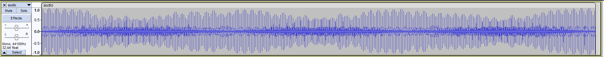
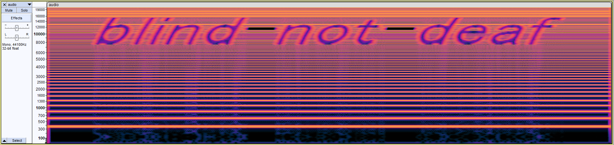

# Audio sample two

## Table of contents

- [Task](#task)
- [Solution](#solution)
- [Lessons learned](#lessons-learned)

## Task

> Like sonar's echo, but this message hides in a unique hue. No audible signal, yet its secret shines through. Can you solve it?

Attachements: 
- [audio.wav](audio.wav)

## Solution
We are given an audio file, which sounds like a complete noise. After checking it with `file` and `exiftool` and finding nothing
I opened it in audacity:

Nothing fascinating. Let's check the spectrogram. You can select it by clicking on "audio" in the upper left corner.

Huh, that's what we were looking for! We may be deaf, but definitely not blind!

Flag: **_sfi19_ctf{blind-not-deaf}_**

## Lessons learned:
- flag can be hidden in any form, even as an 'image' in audio file