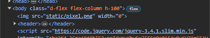
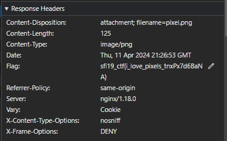

# Metadata

## Table of contents

- [Task](#task)
- [Solution](#solution)
- [Lessons learned](#lessons-learned)

## Task

> You can't trust even the simplest types of files not to track you on the web... Sometimes you can learn very interesting things from these trackers though.

## Solution

Hm, we don't get any attachment to the task. So let's check the source code:

Interesting - there is a `pixel.png` with `width = 0`. So first, we can check it with the 
exiftool and strings, but we won't find anything. So let's go back to source. 

We can additionally check the network tab in the dev tools for suspicious headers etc.

And we got our flag!

Flag: **_sfi19_ctf{i_love_pixels_tnxPx7d6BaNA}_**

## Lessons learned:

- always check the source, response headers, cookies etc