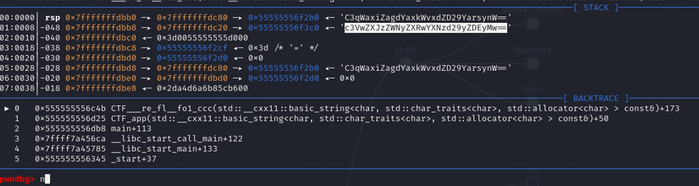

# Missing output

## Table of contents

- [Task](#task)
- [Solution](#solution)
- [Lessons learned](#lessons-learned)

## Task

> We developed a new password management tool that encrypts your passwords into, well, encrypted strings. And another
> tool that decrypts them. No need for master passwords or databases! It's in early development stages though... Try it
> out:
>
> C3qWaxiZagdYaxkWvxdZD29YarsynW==

Attachements:

- [password_decoder](password_decoder)

## Solution

We are given some base64 encoded "password" along with "password_decoder" in a form of precompiled, elf file.

First of all, I tried to run it locally, but either with or without passing the password, nothing really happened.

Well, _missing output._

So then I tried to decompile the file looking for something interesting. What I found, is that there is `CTF_app`
function, which as a parameter gets the 'password' provided by us, but returns nothing. Indeed, after checking with
strace, without password program returns error code 1, but with the password, it ends normally with exit code 0. So I
suspected, that somewhere in the program the decoded password is either written to memory, or to some kind of
file etc. if not to the standard output.

So, I started stepping over the program using gdb. At some point, I figured out, that in the
`CTF___re_fl__fo1_ccc`, the 'password' is taken and translated (probably with simple substitution cipher) and stored on
memory stack. So, after going through multiple steps and watching the password being decoded char-by-char I saw
following state in the debugger:

Where (as base64):
- `C3qWaxiZagdYaxkWvxdZD29YarsynW==` is our encrypted password
- `c3VwZXJzZWNyZXRwYXNzd29yZDEyMw==` is our decrypted password

Which translates in [CyberChef](https://gchq.github.io/CyberChef/#recipe=From_Base64('A-Za-z0-9%2B/%3D',true,false)&input=YzNWd1pYSnpaV055WlhSd1lYTnpkMjl5WkRFeU13PT0) to **_supersecretpassword123_**.

Flag: **_sfi19_ctf{supersecretpassword123}_**

## Lessons learned:
- Sometimes you don't need to understand the code to be able to solve challenge
- It's worth to know GDB
