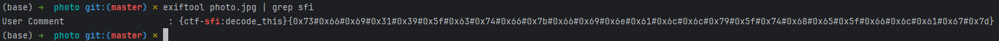

# Photo

## Table of contents

- [Task](#task)
- [Solution](#solution)
- [Lessons learned](#lessons-learned)

## Task

> In a secluded garden, a traveler finds a photo beneath mossy stones. Clues within inspire a quest guided by nature's beauty. Uncover the mystery with harmony and sustainability.

Attachements: 
- [photo.jpg](photo.jpg)

## Solution

As usual in the forensic category, we run the exiftool and we get A LOT of output there. So let's grep-to-win:

And decode it using [CyberChef](https://gchq.github.io/CyberChef/#recipe=Find_/_Replace(%7B'option':'Regex','string':'%23'%7D,'',true,false,true,false)From_Hex('0x')&input=MHg3MyMweDY2IzB4NjkjMHgzMSMweDM5IzB4NWYjMHg2MyMweDc0IzB4NjYjMHg3YiMweDY2IzB4NjkjMHg2ZSMweDYxIzB4NmMjMHg2YyMweDc5IzB4NWYjMHg3NCMweDY4IzB4NjUjMHg1ZiMweDY2IzB4NmMjMHg2MSMweDY3IzB4N2Q)

Flag: **_sfi19_ctf{finally_the_flag}_**

## Lessons learned:
- Grep is always here to help you!
