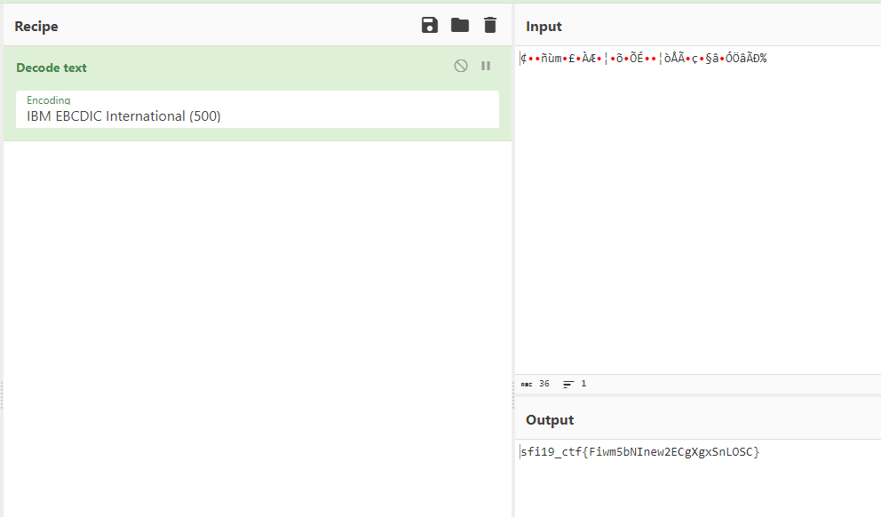

# Ancient encoding

## Table of contents

- [Task](#task)
- [Solution](#solution)
- [Lessons learned](#lessons-learned)


## Task

> We extracted this file from an ancient mainframe, a relic of bygone technological eras. Yet, its encrypted contents remain a mystery. Do you have the expertise to unravel its secrets?

Attachements: 
- [file.data](file.data)

## Solution

We are given _.data_ file. Let's check it using `file` command:

> file.data: compress'd data 12 bits

Nothing useful. What about [cyberchef](https://gchq.github.io/CyberChef/#recipe=Detect_File_Type(true,true,true,true,true,true,true)&input=H52MIXiEkTMGjQ8FZtiEOSPDBR08dF6AmEgRBsWLFy1mxGiDBg2MOHJgpAhGgZgyZ9K4AdHxY8KFX%2BAoVEmnDMQvacS0cQhRAREkSHSk4PKjSBMgWlyYgMJCaJIkM6oAaXIjRREcNoxwYXJjRBAvPk4k8aKiBpUuO4RA6QKmiIKSZdyQUaAA)? 

```
File type:   Tarball
Extension:   tar.z
MIME type:   application/x-gtar
```

Much better! Now we know that this is a tar.z file. Let's unpack it (first we need to change the extension to tar.z):

```bash
$ mv file.data file.tar.z
$ uncompress file.tar.z
```

And we got **file.tar** file. At least one step closer to the flag. So let's uncompress it:
```bash
$ tar -xf file.tar
tar: This does not look like a tar archive
tar: Exiting with failure status due to previous errors
```
Wait, what? If not tar, so what is it? Let's check again with [CyberChef](https://gchq.github.io/CyberChef/#recipe=Detect_File_Type(true,true,true,true,true,true,true)&input=ITxhcmNoPgpmbGFnMi50eHQvICAgICAgMCAgICAgICAgICAgMCAgICAgMCAgICAgNjQ0ICAgICA4OSAgICAgICAgYApiZWdpbiA2NDQgZmxhZ19wbGFpbnRleHRfaWJtLnR4dApESEg6KVw/RU1AWi4mUCw6KUlJM1VATTcpRTg2RlxMNyNBXj4nSV4qNVRdO0JQXWBFCmAKZW5kCgo) 

```
File type:   Linux deb package
Extension:   deb
MIME type:   application/vnd.debian.binary-package
```

Interesting. Let's unpack it using `ar`:

```bash
$ ar x file.tar
```

And we got **flag2.txt**. Good, let's check its content:

<pre>
$ cat flag2.txt
begin 644 flag_plaintext_ibm.txt
DHH:)\?EM@Z.&P,:)II3U@M7)E86F\L7#A^>'I^*5T];BP]\E
`
end
$ file flag2.txt
flag2.txt: uuencoded or xxencoded, ASCII text
</pre>

Uuencoded? So uudecode it!

_Note: `uudecode` is part of sharutils package_

```bash
$ uudecode flag2.txt
$ cat flag_plaintext_ibm.txt
�����m����Ɖ�����ɕ����Ç燧������%#
$ file flag_plaintext_ibm.txt
flag_plaintext_ibm.txt: Non-ISO extended-ASCII text, with NEL line terminators
```

Hm, some binary data in there. But let's connect the puzzles. It is **IBM** plaintext and according to challenge description:

> We extracted this file from an ancient mainframe [...]

And who was the main producer of the mainframe computers? IBM!

So after some research, I found out that IBM used **_EBCDIC_** encoding in their file. 
After decoding it using [CyberChef](https://gchq.github.io/CyberChef/#recipe=Decode_text%28'IBM%20EBCDIC%20International%20(500)'%29&input=ooaJ8fltg6OGwMaJppT1gtXJlYWm8sXDh%2BeHp%2BKV09biw9Al&oenc=65001):



Flag: **_sfi19_ctf{Fiwm5bNInew2ECgXgxSnLOSC}_**

## Lessons learned:
- Do not trust extensions
- CyberChef has better file type detection than `file`
- Take the challenge description into consideration if you are stuck