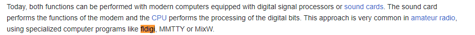
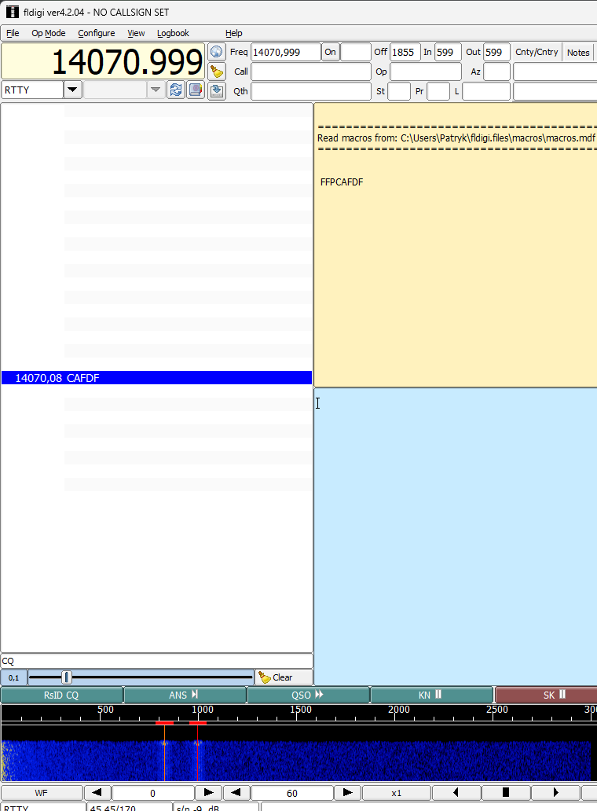
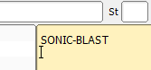

# Audio Sample One - Writeup

Category: **_Forensic_**

## Table of contents

- [Task](#task)
- [Solution](#solution)
  - [Reading the file](#reading-the-file)
  - [What's wrong?](#whats-wrong)
- [Lessons learned](#lessons-learned)

## Task

> Amidst the whispers of a garbled radio transmission lies a barely audible signal. It was recorded somewhere near the sea.

Attachements: 
- [audio.wav](audio.wav)

## Solution

We are given audio file in WAV format. It could be open normally, but nothing but noise and some weird beeping can be 
heard. As usual in the forensic category, let's see the exiftool output:

> (part of the output) 
> User Defined Text               : (Software) fldigi-4.2.04 (libsndfile-1.2.2) 
> Recording Time                  : 2024:04:02 20:37:30z 
> Comment                         : RTTY freq=14070.999 
> Title                           : Generated audio 

We see at least a few interesting things. Mainly these are:
- **User Defined Text** - that definitely gets our attention. We see that it was recorded using fldigi software
- **Comment** - `RTTY freq=14070.999` 

After some easy research, we can find a [wikipedia article](https://en.wikipedia.org/wiki/Radioteletype) about RTTY - Radioteletype.
From it, we learn that this is a system for telecommunication developed for US Navy (remember _recorded somewhere near the sea_ from the task description?).
Quick search for 'fldigi' - BINGO!

(You can find the program [here](http://www.w1hkj.com/files/fldigi/))

### Reading the file

Let's open a file using fldigi - to do it you need to go to File > Playback and choose the file.
For this challenge, it might be needed (but should not be) to adjust the settings to use Op codes > RTTY > RTTY-45.
It is also needed to change the frequency to 14070.999, as we found in exiftool output.

We see some letters appear on the left sidebar—you need to click double times on this channel to adjust the program to search
for data on these exact frequencies. You may need to play back the file multiple times.

### What's wrong?

But unfortunately - the data appears to be completely random. After some googling I thought about LSB coding - it turned out
fldigi can decode it automatically, so we can just click 'REV' button on the bottom right toolbar. Annnd we got the flag!

The flag: sfi19_ctf{SONIC-BLAST}

## Lessons learned:
- always check the exif data
- and carefully read the task description!