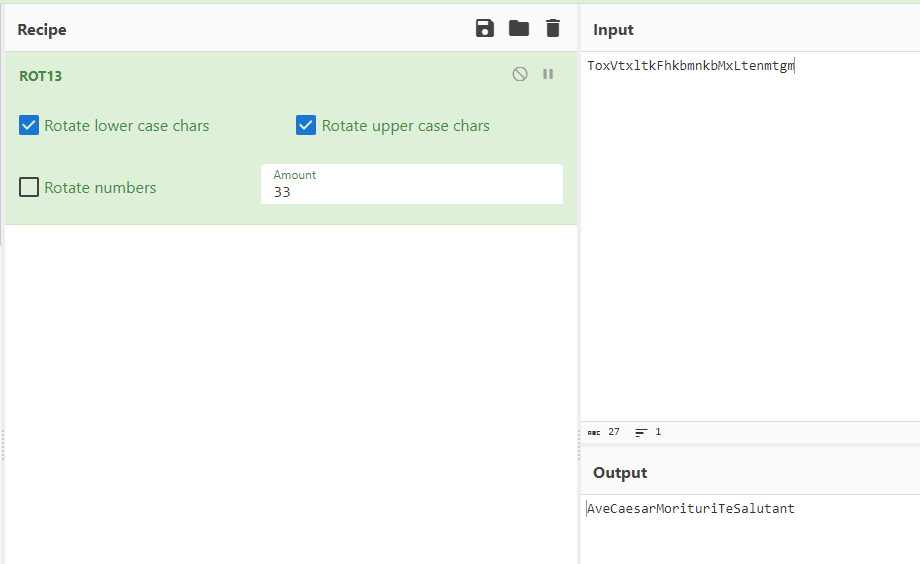

# Chief's message

## Table of contents

- [Task](#task)
- [Solution](#solution)
- [Lessons learned](#lessons-learned)

## Task

> In pursuit of truth, letters dance in circles. Crack their code, and secrets swirl.
>
> ToxVtxltkFhkbmnkbMxLtenmtgm

## Solution

So let's think about it — what types of cipher do we know that makes letters _dance in circles_? 
My first thought was Caesar's Cipher (_aka ROT 13_) — and it was a good guess. After checking a few different shifts
in [CyberChef](https://gchq.github.io/CyberChef/#recipe=ROT13(true,true,false,33)&input=VG94VnR4bHRrRmhrYm1ua2JNeEx0ZW5tdGdt)
I got:

Flag: **_sfi19_ctf{AveCaesarMorituriTeSalutant}_**

_Fun fact: The gladiators used this salutation to caesar before fights in arenas_

## Lessons learned:

- Some challenges are not that complicated as they might look like