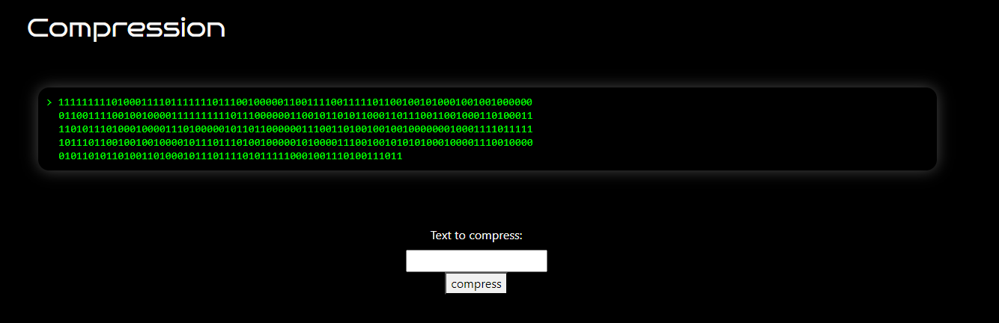
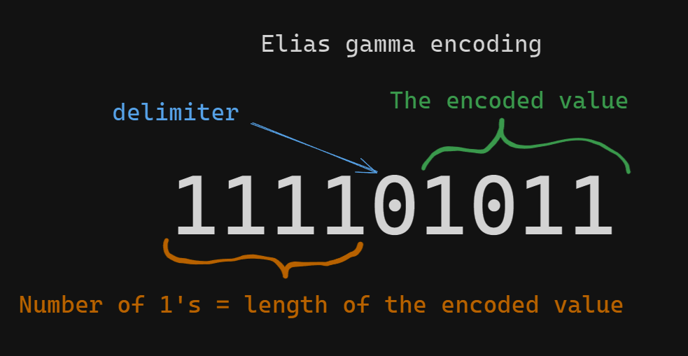

# Compression

## Table of contents

- [Task](#task)
- [Solution](#solution)
  - [Encoder](#encoder)
    - [Elias encoding](#elias-encoding)
    - [Get counts](#get-counts)
    - [Compute probabilities](#compute-probabilities)
    - [Utility functions](#utility-functions)
    - [Encode bit](#encode-bit)
    - [Encoding](#encoding)
  - [Decoder](#decoder)
    - [Tries](#tries)
    - [Decode output value](#decode-output-value)
    - [Last letter decode](#last-letter-decode)
    - [Final decoding](#final-decoding)
- [Lessons learned](#lessons-learned)

## Task

> 11111111101000111101111111011100100000110011110011111011001001010001001001000000
> 01100111100100100001111111111011100000011001011010110001101110011001000110100011
> 11010111010001000011101000001011011000000111001101001001001000000010001111011111
> 10111011001001001000010111011101001000001010000111001001010101000100001110010000
> 0101101011010011010001011101111010111110001001110100111011

Attachements:

- [compression.js](compression.js)

## Solution

We are given the compression tool, which we can try in our browser.



So, let's see a few examples of compression:

> a => 111101101110110010011010111000

> aaa => 11111101001111111010010010011010011111111101111111011111101010

> text => 11111101100001111101000000010011000101111011001100001011101111100101011110110101

> This is a compressed text => 1111111110100110110111111101011010000110001101001001111001110101101000111110001101101100001010111101011111000110010011001010011101100000001110011010111101001111000010010001101100100100011011100111011000101011101010001000101111010001011010000010011001010110011000010010010001011001100110111100111010100010010111100010010011000011111100010100011011

Nothing catches our attention, so let's try to break down the script we found in the page source.


## Encoder

But first, lets give it to chatGPT to rewrite to python. Who wants to even look at javascript?

- [encoder.py](assets/encoder.py)

The first part of code is a bunch of constants. We can skip it, at least for now. Let's move directly do Encoder methods.

### Elias encoding
```python
    def elias(self, value):
        value_bin = bin(value)[2:]
        return "1" * len(value_bin) + "0" + value_bin
```

This method performs some kind of the _[Elias gamma encoding](https://en.wikipedia.org/wiki/Elias_gamma_coding)_.



### Get counts

```python
    def getCounts(self, string):
        return [string.count('0'), string.count('1')]
```

I put it here only to compare it with its JS version.

```js
    getCounts(string) {
        return string.split('').reduce(([a, b], x) => (x == '1' ? [a, b + 1] : [a + 1, b]), [0, 0]);
    }
```

I think it speaks for itself.

### Compute probabilities

This function basically returns the probabilities of the char to be 0 or one, shifted by the `PROB_BITS` constant.

```python
    def computeProbs(counts):
        total = sum(counts)
        probs = [math.floor((v << PROB_BITS) / total) for v in counts]
        # fill rounding errors
        sum_probs = sum(probs)
        probs[0] += ((1 << PROB_BITS) - sum_probs)
        return probs
```

### Utility functions

There are a bunch of utility functions to perform conversion, from int to hex, from str to bin etc.

### Encode bit

The first method really connected with encoding. It computes the threshold and if the bit is equal to 0, sets the range field
to that threshold. If not, it tightens the low and range values by the threshold.

```python
    def encodeBit(self, bit, probab):
        thr = (probab * self.range) >> PROB_BITS
        if bit:
            self.low += thr + 1
            self.range -= thr + 1
        else:
            self.range = thr
```

### Encoding

And here the magic happens. What we get is:
1. Convert text to bin
2. Compute counts and probabilities
3. Encode every bit and update the `self.low` and `self.range` values with it
4. If conditions on `self.low` and `self.range` are met, write it to the output
5. Write the checksum and elias encoded counts to the output

So, the output string we get is: `ELIAS_ENCODED_COUNTS + COMPRESSED_TEXT + CHECKSUM`.

```python
    def encode(self, text):
        # Transform text to its binary representation
        bin_text = self.strToBin(text)
        # Get counts of 0's and 1's
        counts = self.getCounts(bin_text)
        # Get the probabilities
        probs = self.computeProbs(counts)

        code = ""
        # For every bit
        for bit_s in bin_text:
            bit = (bit_s == '1')
            # Encode it
            self.encodeBit(bit, probs[0])
            
            # Write the `low` as a binary output if conditions are met
            # Don't care about exact values
            # I will call it 'weird' or 'original' condition for simplicity
            # You will never see this again
            if (self.low & NORM_MASK) + self.range <= NORM_MASK:
                to_write = self.low >> NORM_SHIFT
                code += self.valToBin(to_write)

                # Update the low and range
                # Don't care about exact values as before
                self.low = (self.low << OUT_BITS) & STATE_MASK
                self.range = ((self.range << OUT_BITS) | 0xFF) & STATE_MASK

        # Write the checksum to the ouput as a binary number
        to_write = (self.low + self.range) >> NORM_SHIFT
        code += self.valToBin(to_write)

        # Write counts as elias encoded at THE BEGINNING of the output
        counts_enc = [self.elias(c) for c in counts]
        encoded = ''.join(counts_enc) + code
        return encoded
```

## Decoder

_Note: Some checks were intentionally extracted to methods, to make script more readable._
_I also skip some less relevant methods for simplicity._
_They all can be found in the [decoder script file](assets/decoder.py)_

So, if we know, how the encoding is made (on a very high level), we can try to decode it.

The idea we will use is some kind of bruteforce, but with some big improvements we can observe in the encoding script.

## Tries

Firstly, let's prepare our script for trying both one and zero:

```python
    def try_one(self, _low, _range, decoded):
        thr = (self.probs[0] * _range) >> PROB_BITS

        low_1 = _low + thr + 1
        range_1 = _range - thr - 1

        return low_1, range_1, decoded + "1"

    def try_zero(self, _low, _range, decoded):
        thr = (self.probs[0] * _range) >> PROB_BITS

        low_0 = _low
        range_0 = thr

        return low_0, range_0, decoded + "0"
```

## Decode output value

Secondly, not every character is displayed on the output. Only these, which met this weird condition.
What we can do about it, is:
1. Start with the same conditions for `self.low` and `self.range` as in the encoding script
2. Take the value (`val`) from the original output
3. Try different combinations of 0's and 1's, char by char
4. Until our `self.low` and `self.range` do not meet the weird condition.
   1. Then, if normalized `self.low` differs from `val` - it's the wrong combination, skip it
   2. If not, it **might be** a good solution, add it to possible answers

For the implementation purposes, I did is a queue, to which I put thirds `(_low, _range, _decoded_test)`,
starting with `(0, MAX_RANGE, '')'`. *Tries* are added to the queue. I repeat the steps above until the queue is empty.

```python
     def _decode(self, val, _low, _range, decoded):
        """
        Decode the value.

        :param val: The value from the original output, as int
        :param _low: Current `self.low`
        :param _range: Current `self.range` value
        :param decoded: Already decoded string
        :return: List of possible answers, which meet the conditions.
        """

        # Start with adding 0 and 1 to already decoded string
        q = [self.try_one(_low, _range, decoded), self.try_zero(_low, _range, decoded)]

        answers = []
        while q:
            _low, _range, decoded = q.pop(0)

            # Could not produce the output, skip it
            if self.meet_out_condition(_low, _range) and not self.check_low(val, _low):
                continue

            # Could produce output, mark as possible answer
            if self.meet_out_condition(_low, _range) and self.check_low(val, _low):
                _low, _range = self.update_after_output(_low, _range)
                answers.append((_low, _range, decoded))
                continue

            q.append(self.try_zero(_low, _range, decoded))
            q.append(self.try_one(_low, _range, decoded))

        return answers
```

### Last letter decode

The method above will not produce the valid string (as UTF-16). The length of any of the strings is the multiplication of 16. 
It will produce something, we can already decode into the flag (by decoding this as UTF-16), but with last letter wrongly displayed.
But why not make the script complete?

We still do not use the checksum, and we know that the weird original condition will never again be met.

So, let's fill the missing values (until `len(decoded) % 16 == 0`) and skip all the combinations which will produce output
and which produce the wrong checksum at the end.

```python
    def _decode_last(self, checksum, _low, _range, _decoded):
        """
        Decodes the last character. Fills up the string for the length to be divisible by 16.

        Skip all the combinations which do not produce the valid output.

        :param checksum: Checksum to perform checks
        :param _low: Current `self.low`,
        :param _range: Current `self.range`
        :param _decoded: Already decoded string
        :return:
        """

        q = [self.try_one(_low, _range, _decoded), self.try_zero(_low, _range, _decoded)]

        answers = []
        while q:
            _low, _range, decoded = q.pop(0)

            # We already processed all output characters, so it cannot be an answer
            if self.meet_out_condition(_low, _range):
                continue

            # If has valid checksum, mark it as an answer
            if len(decoded) % 16 == 0:
                if self.has_valid_checksum(checksum, _low, _range):
                    answers.append((_low, _range, decoded))
                continue

            q.append(self.try_zero(_low, _range, decoded))
            q.append(self.try_one(_low, _range, decoded))

        return answers
```

### Final decoding

And the final decoding method, which uses both methods made previously and returns only the valid answers:

```python
   def decode(self, bin_encoded):
        """
        Decodes the string produced by the Encoder class.
        :param bin_encoded: Encoded string, as binary number
        :return: List of possible answers
        """
        # Decode counts, checksum and probabilities
        counts, rest = self.decodeElias(bin_encoded)

        chars = self.split_to_8bit(rest)
        chars, checksum = chars[:-1], chars[-1]

        self.probs = Encoder.computeProbs(counts)

        # Create initial try
        # from the values set in Encoder constructor
        next_tries = [(0, MAX_RANGE, "")]

        # For every value from the output, decode it
        for single_bin in chars:
            val = int(single_bin, 2)

            current_tries = next_tries
            next_tries = []

            for _low, _range, _decoded in current_tries:
                next_tries += self._decode(val, _low, _range, _decoded)

        # Decode last character
        current_tries = next_tries
        next_tries = []
        for _low, _range, _decoded in current_tries:
            next_tries += self._decode_last(int(checksum, 2), _low, _range, _decoded)

        # Return only decoded binary values
        return [d for (l, r, d) in next_tries]
```

Now, we can use our decoder, which you can find [here](assets/decoder.py) and get our flag:
```python
    answers = Decoder().decode(
        '1111111110100011110111111101110010000011001111001111101100100101000100100100000001100111100100100001111'
        '1111110111000000110010110101100011011100110010001101000111101011101000100001110100000101101100000011100'
        '11010010010010000000100011110111111011101100100100100001011101110100100000101000011100100101010100010000'
        '11100100000101101011010011010001011101111010111110001001110100111011'
    )

    print("ANSWERS")
    for answer in answers:
        print(Decoder.binToUtf16(answer))
```

Returns (in less than 0.2 sec, even as a 'bruteforce'):

> ANSWERS 
> 
> sfi19_ctf{entropy_coding}

Flag: **_sfi19_ctf{entropy_coding}_**

## Lessons learned:
- Sometimes reverse engineering is not that complicated
- We do not need to understand the code completely, to be able to make something with it
- Even the bruteforce, but correctly optimized can be really fast.