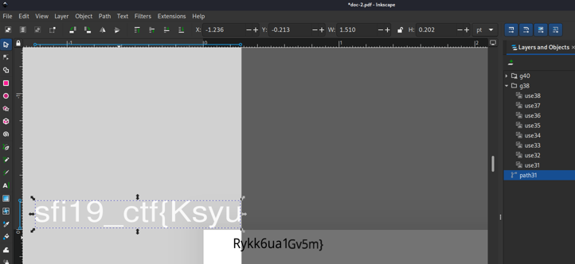

# Document

## Table of contents

- [Task](#task)
- [Solution](#solution)
- [Lessons learned](#lessons-learned)

## Task

> What about a journey across a huge document like a captain on the endless sea?

Attachements:

- [PDF document](doc.pdf)

## Solution

The easiest way to get the flag was to open the file in Inkspace (as we see that it in EXIF info).

There, after zooming in and removing carefully objects from 'Layers and Objects' window, we can see
three parts of the flag (they were put in random places in the doc, not in the same layout as on screenshot).

Two parts of them:
- _Rykk6ua_ could be extracted using [pdftotext](https://www.xpdfreader.com/pdftotext-man.html)
- _1Gv5m}_ could be extracted using [pdfimages](https://www.xpdfreader.com/pdfimages-man.html)

Flag: **_sfi19_ctf{KsyuRykk6ua1Gv5m}_**

## Lessons learned:
- Always read the exif data
- Be careful while searching through big documents