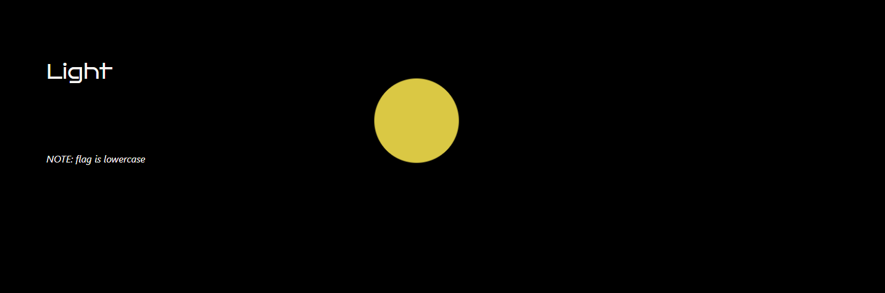
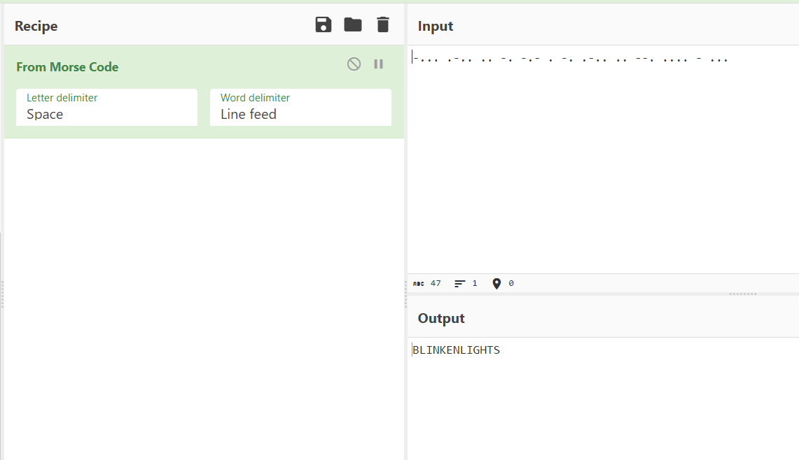

# Title

Category: **_Misc_**

## Table of contents

- [Task](#task)
- [Solution](#solution)
- [Lessons learned](#lessons-learned)


## Task

> There was no description. Really. The only thing we got is the pulsing
> yellow dot which sometimes changes color to blue back and forth.



## Solution
First, it runs in the browser so let's check the JS code for it:

```js
    data = [1418, 506, 506, 555, 2072, 482, 1597, 434, 482,2031, 592, 482, 2063, 1410, 592, 
        1900, 1410, 592, 1418, 2031, 442, 2063, 1573, 442, 1900, 482, 1453, 482, 442, 2063, 
        434, 442, 1967, 1453, 1410, 434, 2072, 506, 442, 592, 442, 1967, 1573, 1930, 506, 592, 482];
    document.addEventListener("DOMContentLoaded", _ => blick(0));

    function setColor() {
      let x = document.getElementById("square");
      x.style.backgroundColor =
      x.style.backgroundColor == "rgb(70, 119, 224)" ? "#e0ce46" : "rgb(70, 119, 224)";
    }
    function stopColor() {
      clearInterval(myInterval);
    }

    function blick(index) {
      idx = index % data.length;
      timeout = data[idx];
      setTimeout(() => {
        setColor();
        blick(idx + 1);
      }, timeout);
    }
```

An interesting part for us is in the `data` array. It does not appear to be random. I don't know why, but it nearly 
immediately remind me of the morse code (maybe because of the blinking dot?). So let's assume:
- values ~2000 - word breaks
- values ~1500 - dashes
- values ~500 - dots

So for example serie like this:
```
1418, 506, 506, 555, 2072, 482, 1597, 434, 482, 2031, 592, 482
```
would become:
```
-... .-.. ..
```

Let's put it in the [cyberchef](https://gchq.github.io/CyberChef/#recipe=From_Morse_Code('Space','Line%20feed')&input=LS4uLiAuLS4uIC4uIC0uIC0uLSAuIC0uIC4tLi4gLi4gLS0uIC4uLi4gLSAuLi4):


Bingo! We got the flag:

**_sfi19_ctf{BLINKENLIGHTS}_**


## Lessons learned:
- sometimes is worth to trust your intuition