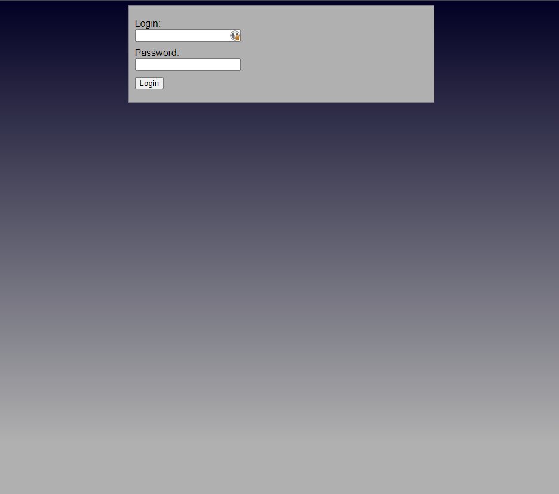
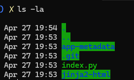
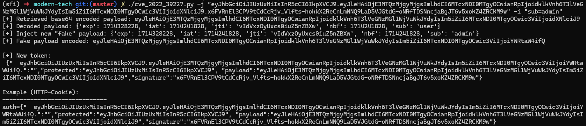
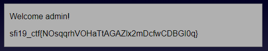

# Modern tech

Category: **_Web exploitation_**

## Table of contents

- [Task](#task)
- [Solution](#solution)
  - [Exposed .git](#exposed-git)
  - [Git dump](#git-dump)
  - [Not-so-modern tech](#_not-so-modern_-tech)
  - [JWT token forgery](#jwt-token-forgery)
- [Lessons learned](#lessons-learned)

## Task

> In the digital realm, the lock screen stands enigmatic, serving as a barrier or an ornament - its true purpose veiled
> in uncertainty, waiting for revelation.
>
> [link to the website]

## Solution



We are given a 'modern-tech' website, with a login form. The site is basic and nothing can be found in the source code /
cookies / requests etc. So, what we can do is to search for subpages on the website using automated tools. For example,
we can run `dirb` to search for hidden files and directories.

What it would output will be few pages:

- .git/HEAD
- jinja2-html/
- index.py
- app-metadata/requirements.txt

## Exposed .git

Okay, we see that the .git directory is exposed. We can try to scrap it
with [git-dumper](https://github.com/arthaud/git-dumper).

```
git-dumper <url> modern_tech
```

What we get is exactly what `dirb` gave us, but now we get also the source code. You can find it as
zipped [here](assets/modern-tech.zip).



## Git dump

First, let's check the index.py. We can find there few interesting things:

```python
    # DEV LOGIN: user:nd4DuFLLmpvF
```

```python
import python_jwt as jwt


# some code
def parse_jwt(cookies, key):
    header, claims = None, None
    if "AUTH" in cookies:
        auth_cookie = unquote(cookies["AUTH"].value)
        header, claims = jwt.verify_jwt(auth_cookie, key, ['HS512'])
    return header, claims
```

```python
    if claims is None or "sub" not in claims:
        template_result = env.get_template("index.html").render()
    elif claims["sub"] != "admin":
        template_result = env.get_template("logged-in.html").render(sub=claims["sub"])
    else:
        template_result = env.get_template("logged-in.html").render(sub=claims["sub"], message=os.environ["FLAG"])
```

So, what we have here:

- We have possible developer account credentials - it turned out that they can be used for login
- The website uses JWT tokens
- We see that [python-jwt](https://pypi.org/project/python-jwt/) library does the verification and parsing of JWT
- We need the `sub='admin'` claim

## _Not-so-modern_ tech

Okey, let's check the requirements and the `python-jwt` page.

```python
# requirements.txt
python-jwt~= 3.2.0
jinja2~=2.9
MarkupSafe~=1.0
```

> All versions of python-jwt are now DEPRECATED. I don't have the time to maintain this module.
>
> Note: Versions 3.3.4 and later fix a vulnerability (CVE-2022-39227) in JSON Web Token verification which lets an
> attacker with a valid token re-use its signature with modified claims. CVE to follow. Please upgrade!

So, all versions up to 3.3.3 are vulnerable to **_CVE-2022-39227_** and we have 3.2.0? Interesting, isn't it?

## JWT token forgery

What we can learn about [CVE-2022-39227](https://cve.mitre.org/cgi-bin/cvename.cgi?name=CVE-2022-39227) is:

> An attacker who obtains a JWT can arbitrarily forge its contents without knowing the secret key

It's exactly what we are looking for - we have the JWT token (from the cookies) and want to change 'sub' claim from '
user' to 'admin'.

After some googling I found [proof of concept of the vulnerability](https://github.com/user0x1337/CVE-2022-39227).

We can use it to forge the token and inject the claims we want.

```python
    python3 cve_2022_39227.py - j < JWT - WEBTOKEN > -i "sub=admin"
```



From the command above, we get the new JWT token. We only need to urlencode it, because the browser will interpret
quotes and brackets. Then, we can put it as the content AUTH cookie.



Flag: **_sfi19_ctf{NOsqqrhVOHaTtAGAZlx2mDcfwCDBGI0q}_**

## Lessons learned:

- never expose .git directory. It might lead to source code leak
- try not to expose version used by the app components. The attacker even from this single information can find
  vulnerabilities which can be used to compromise your app