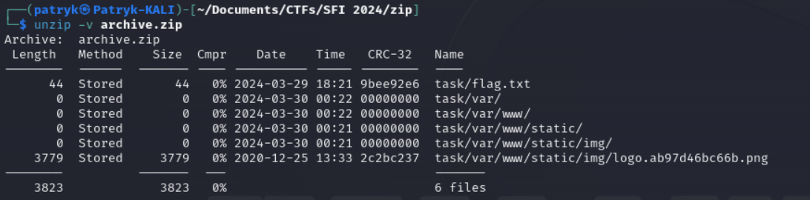
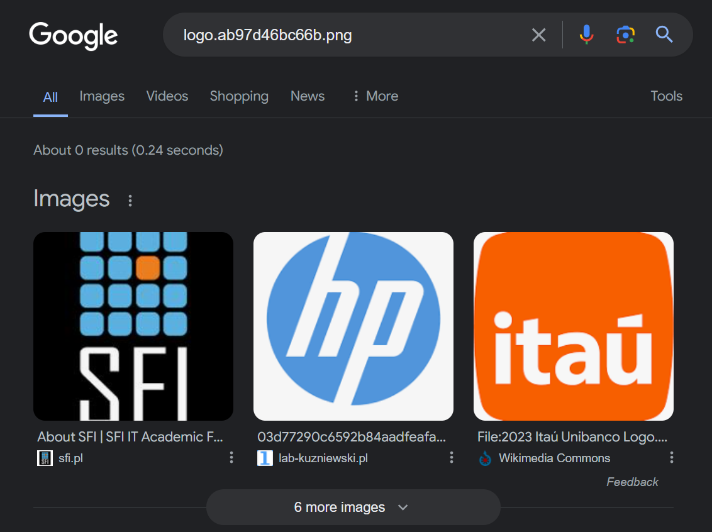
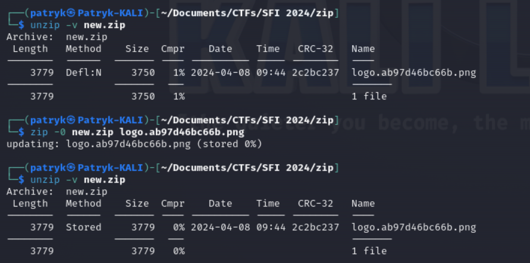
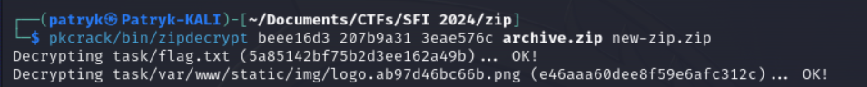
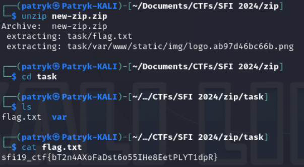

# ZIP

## Table of contents

- [Task](#task)
- [Solution](#solution)
- [Lessons learned](#lessons-learned)

## Task

> This zip file is guarding its contents with well known encryption algorithms, as if they were precious secrets hidden
> in a locked chest. Unforunately, we lost the key. Maybe something can still be done...

Attachements:

- [archive.zip](archive.zip)

## Solution

We are given encrypted zip file. After checking file type
in [CyberChef](https://gchq.github.io/CyberChef/#recipe=Detect_File_Type(true,true,true,true,true,true,true)&input=UEsDBBQDAQAAALKSfVjmku6bOAAAACwAAAANAAAAdGFzay9mbGFnLnR4dBC9SwZoXzUm/7OzZnJUwJnMgOlVB7HpM1IYr47JzjDLF0Fz1aRlVhlcS7vNMqpMY798MNYO9YGtUEsDBBQDAAAAAMYCflgAAAAAAAAAAAAAAAAJAAAAdGFzay92YXIvUEsDBBQDAAAAAMgCflgAAAAAAAAAAAAAAAANAAAAdGFzay92YXIvd3d3L1BLAwQUAwAAAACvAn5YAAAAAAAAAAAAAAAAFAAAAHRhc2svdmFyL3d3dy9zdGF0aWMvUEsDBBQDAAAAALYCflgAAAAAAAAAAAAAAAAYAAAAdGFzay92YXIvd3d3L3N0YXRpYy9pbWcvUEsDBBQDAQAAADNsmVE3wisszw4AAMMOAAAtAAAAdGFzay92YXIvd3d3L3N0YXRpYy9pbWcvbG9nby5hYjk3ZDQ2YmM2NmIucG5nrmqK/CxpK1AOGNmyCe8i6DUzJzW2WQjaG%2BHP1nFJZ0qnfacBHhzP3eG1og8A975BJMgf4O%2BDkQcr7vigT/Z62vC9sPYlRFmEcjbW2D7G50/yHr6mok8F3XKH%2Bo/6745r6zsguEYiYV3HreL9xI7RYJQGipZw8bBJqjiAyuHVSYtj4ttkuJ1YmSH1iD5Q7BuUFaOBVQ38ETyudPzZXtQmdslkQ1mV9XEIdnOJAMJhHF7GSJAETTiFoafJP523GPT4eVYLqsXphMtMxwqsPZs8rVRMEv3ipXvC%2BqxcvLe2YdmiqETKiW75NBqIHp7mSRpJzKEVeBqh36sNXsjKGafXxGlP8L%2BAXygDP/1GDvmYZ%2BOEgdQQm91u0BfdSgIngDW5LE/0fhDICncEyF4DXdJsXgUiZshA9kObQtUYdIWrIUEraIn/CFYMsERHWYE76HCqUmqyNLIRhlElApz91T9eoJq5P4sB/IwXCPaLDq8uYBgNRdBNenpMt5mNryi7PWKko/PBIYQNePiHOAf0IKeyig6v/hbuQK/g/Q3OafgfghvBMAYSb5gL4SjHGxWZ2UbMFGzMz/lJ9lzx5zHBysPgOvr0zjl/CI62VIz2Ml3d3fBZUusw8mdtIfr4bp1aMSr6E7VOeQmOPQc7492MNhOOh/pdf5POvwMcUKhu%2Bsqak4G7X6FhfwCnnRin8GvZ%2B5bCuFRLVCnIK1QAjnvb6tsN3dSHRJ333Onc1G3oZByiWDd8%2BP0sCrfTmg93X9O2WeBFcIF2tVolUNzGF8kR1hylAy9erGDfOmw8R2CPvlH5lqvEnxSFkd/pzD8fGSgjg1SWKnXfbaSo/7u/HY8i1DHQfOUlVlOK8cOUhGzHpKv9jNN2VF/ipfv7%2BmGNvVNfpGHQDg%2BGfiY%2BkcIVdkjD/cLvbDjSal/h3IMYvacUegYbAmVmXaNLWDk%2BSD1/oML0CWfwOsPuVJShFrlV2o7W5vcMPa1TYjkCNuFUKaTxGWN1dAJ6cv68v6MMhbV3hN05sdZHZAN8WLpnBwIb0fVpsYPN%2BL8x42wiXgc60qP38ZOGkzdRa7I2CNGy8ffe8IUev/THsB7gctVA3Bn6MySeWDsGVWXBDQCysGf3dHDal9PvQGdGGCUgQKhDFMdGPqLEYtNgUvppu9X4jOh21eje6Hr0KvielVtrxE/xfV4m6JUZSiek2EIIsVNUQqjh4C5jtPqtXi0mjQFQ%2Bk/7417mA1foQW70RFafRR2mBzIcw6l4uc85G5tMYInWoAOu4gPWJOb4JPiheKl155zE5p%2BSX2PTUaiktnFcBYA5TW5UZugnQzZZHs2xmr9ZhxaKjYpRQ4iPseuCzKRQsc8FleK7lydiIqJa2lTF8oXXIEy5S3ijf4YBxKhBfcHYbF90zyiNQtzTurx5HocW/6qrlXexskUrpLQndHnByz2ZXqGjVfQC5DtjpH9BEkAChdvuYqCfHDf5rNG563AnOVdz7GEU/FtfvnjW7kWFvtrnROZidz%2Bus4/tjOr%2BaaZgznEVwgt1hy/buLHPVkJDL6/CKd6xWRhB3YRDCJrCFya5oexTObCScO5CZop/D%2Ba24uTRX9/M/OahaBkHGQj51pyrzIpY6ruNi/ZA7U/Q4iR6KU3L9frWjUfIXMyRuosxG1RJkFBQoxui89XqG6iuJE8OXmXS/8YWxqHTIAH%2BVwgzdrFOW%2B71FBrBUQ88L8cJTDAYClExJq0ePTvzKHEaCatO3iT4f%2Bq5%2BoOXiU6bu3Q3YvvN%2BB5zR9vSNasNMTycgS0sj26a6ux3aFGL7Y86rQItUd54aPvGQDetUgzutu1wp5nK/ALphajMVXHTv66ok8LCpSobtj%2BKtXATWA1uIyeo1KSPnFaogktgHgXIPsZC/2pz3%2B6uPvn0HLtQeD2ID85vECJ5fizsBlaXkYGCT83BDCzFcykNROzSROhYtb/cU9bhv6h47WZOrKkkCSdSu4ZKdV0vqAWAoTs8UAH8zSA9ded5KGmtZzgSdqqblhDoZgaRrbZWaMKqsT3KOlJci26W4EIjl/vlDQBQFqDzxcEZYgjYQh1piMsHFyWPr9leH4qHCXa97g/o168KNWe/kOJoWLSWQ%2BwSFSODSJ6bFankQBLtWcpJ9KCQCn3VVVrndvxOCzJrHwD9sCtiwxx0zdK6t7Z7ivFkUre5dOgtlZNkQy735z5dpIZrdzKpsogGk2jxepeaubwwzT3y3w1WLEavYA11BLusWUmw%2BfysopYA4VwH2vDXcUXlANvFN7CBBseH8%2BY1UUDGdccwhmxHA77kJLjq%2B4XDlnvnzYpfSWmpqfKQb6fY9p2N2WcQ1ipPxExapEmaVjlyHUG8Jvz9iOaPsqvH3BjAz1Br7e9SSjdS%2BDCtcQ0rVny0I6pgE5eo/L2FInUgW/qlUKqSZuijQzwYS26oevJNqSLYPRhoZ1lmMtM7EgJTiF/XJQpGscCSAKJmZsHaiOjpnDPoOsZ24Rz140BgYtPCnOHoKIWF2AdKdryHLtXfhbhujutxrpQofKqGwnDlxhCJ4rZPIVLomvJlATo3%2BKYu3YabIirQAYbkpE27FFfewDlIwScGuuCJMBn/RLynIJ2GcofJsn/P8oygIWuBTLByfssqoBdV/UF2xqW/qmwUV8PsHLmGc9ifHsV5C/KLCFrE5hykDVVTvFF/Lp200h5UEcfJSEAF3FiYstsBRXmDn%2BBE0OfqtenbNKpXHGKPu/%2BuG8nFa3qkI6yR6j0Kg%2BVLCr/r9INQ7BzwyE0mDxsXP1eW63iD67urvEjntli7CgDXLGTCUsSXLfzLfdOVJz8ts9D63q2FS4zueaQsGLFV8OzSxCT90R2vHW4t8iZ2w/dxK0ug871WXUSAK5soXuDGG/7ADKnCUdV0DRdWjAlR/n6TMbWJAsbF7AdMlmpS5iTpWII/IEuagGGBqKFW7QZydNAgqOMzYmTTywiSLoSpz8KGCqJEe249hn3saSA7pUV3iQ4u0KBeR55IdXyUa/HzmN8gtNI7xBdt6aWhqdJ3%2BNUxJx3BVs4iBmfgW0MBM6cxesbEsmtKXdqUV3OcrhRcwVVyk38OcAP3gckq6/db2yZ7plH7M/sSCsFA6nL2j6qpjYof4SIFAKzWfC2%2Bhnkj07VcpxAsm9ih8N1nvq8aAM2CWTV8so2TmlLmGEgawC%2BB12EpIA5gS7ALj5V5FUdM6JZgNAk9mGv2pWXkTPwoQkbwJIyz8/76TBAk3afjXgZRsrITCT9BILEUC1tvwtsvTgyyXSll5hLYsPi4ejbIao4X1sCbLbKgMuwlgh/nH0vw4vZJgj5iW5ohnLFMGqo0QHUQ%2Baf9A7IKHbiiaBRVrUOzRU8gDrwHijUSn/Dw1uX14khptrLWCrNlAkiQYkhFAi7G9X%2B0kqQJttM9gGXv44DasIvxm1hG2lV6ZkrMotOTzzJgjZygQ3hkbl30f3bpdQz4HjTAiPrHs%2BSLxrF%2BOIMdOKViLwgzC1IwUcCiWUxcVh/Tm63R8JktpAW4WokIowBoJvNn3mKBPVPZP97X78AZ4VlWuA07z4v00wt5Q0XwaSoKO3KxWAHSVD8ankYTApBoxHgX3m3K%2BNlaFlLTBkNYGPDl%2BAjP/C7TZkJ2GMx%2B8xqBABykGHBDphwTndL9gPSySSFKI%2B1XygGxL%2Bgp1Z68G/AxcK%2BdLzxdhgx8Wax5P0jTRbyjGiCBTJ%2B0bwGdvib/30n3iE/K0/sY6kFa7BxRaioalsC2n5h8zf8waP58UKuOsskg1xMcngMuSBdHRaoiCARjDT0qS%2Bd3kw2/5FVq2MEXq2Txdd3bJOyiuwWyVRJ9oLO/CoVY/fEfjWs67PfhX5aX5PhGLrOatVLr9MSnRJTNyWxnSg1x4B6zo9obwVdl6cR8UzaS%2BbWJ9bcdMrExeg0iLgUluMJdz50vVbK%2BMcZt/rJ95x4oKNvLeridQOqZzn9P4NOwglthxC8j2zCu0I/YT5cFsxlnCD0HMbRUur2W7/9ygAHvdeuZmsT6WHH6VZe02RPEe1JnK8HvE4bcoIF89IV9KbSiNj8FFUGvsVOXhLadm5C0DfPNDTcHuFZFzwQvBdmR7MzEt5qnp9LlckDKerrVL/ouuGTOOzBKU4d7eb0u1Eyn1fhwvn7AFdDdyq2srrF%2BoOIysWLIUevJkO8d4B5B6HcmPECftwae0HiA92LRf6dlOBp/4/SoRqRQIB%2BkoayZrXxa0cugulCCN5ZN%2BdjL1LMuHcqXTGzM6N/NWkiCqyD2LvJhGZVo1UQDScLLDcrpLYD0pnDZBCeVJWjRVNHed9Q7160xxEA07tVt5/R1OTdTva2DEBpW4%2BpSw8ynemsHB9nPrDXjUDrz9ZydU%2BKNN4JmV8WIJ%2BU%2BY%2BrMeNEMxI5t%2BuDB6cFIU81W1pfhi7ayKbTicZGoqedrDhnHKjJEMiEnej4veYPoFkxgYphFVYL8%2BTwYNRqQCiN9o/7HIOVzq0HxvhxkXEIcnHjenQKQMaYaRJLYdVYC9zXox9n%2B3tuEdD9Fq13HpoYDf27v24WA%2BF%2BVgGNTNJl5MxkkDGKEtd%2BD2fQzCTkFUtIEIBgOvCXnYfLfafXv49YyG1zN0XwpX%2BgLEK70POgqbIL8dFGzGiaSjr32%2BjS49sQFIk6uxFFJ%2B/ej%2B%2BUBDTjENtu06mL/DhWH4pGu%2BY7jRx7Pm4uk7nFshXowCliLJAF4quWiGnf9hggCL55JmsAfiO87/uPMcBs2BMU%2Btz3zGTzMZIMJQFleGBnS4D4JrO4xFJOriDT3cox1fHPI0J0b/edEDi1pxSqncdzxafRS0/3Lr1Q%2BHjlSj2AdiuXbDtKiS%2B04XpibpjrwKeA4wm%2BQ9%2B7g815JVHGR0bmx%2BgFf9k25mBjSYfyOl5JN7OcYTDl6F3i2fsHRYHQ8UHCwbV0UDd9RE3b8svv%2BhkaU046gALbXPJgV6o3o3WPr0RMFjTIz6FIeRZcSNsuqh1oxets2asdmcixlTgvXPiKAQIRA%2BSBRMmnWZgq2oa05OAteQTPkC4faUJ1mSdJV14HYAe2ebKfBdte4vTIqooRQSwECPwMUAwEAAACykn1Y5pLumzgAAAAsAAAADQAkAAAAAAAAACCApIEAAAAAdGFzay9mbGFnLnR4dAoAIAAAAAAAAQAYAACQaI39gdoBgK8t%2By%2BC2gEAkGiN/YHaAVBLAQI/AxQDAAAAAMYCflgAAAAAAAAAAAAAAAAJACQAAAAAAAAAEIDtQWMAAAB0YXNrL3Zhci8KACAAAAAAAAEAGAAAKnjtL4LaAYDtQe8vgtoBACp47S%2BC2gFQSwECPwMUAwAAAADIAn5YAAAAAAAAAAAAAAAADQAkAAAAAAAAABCA7UGKAAAAdGFzay92YXIvd3d3LwoAIAAAAAAAAQAYAACE2u8vgtoBAN488i%2BC2gEAhNrvL4LaAVBLAQI/AxQDAAAAAK8CflgAAAAAAAAAAAAAAAAUACQAAAAAAAAAEIDtQbUAAAB0YXNrL3Zhci93d3cvc3RhdGljLwoAIAAAAAAAAQAYAIDi1tMvgtoBAN488i%2BC2gEAhNrvL4LaAVBLAQI/AxQDAAAAALYCflgAAAAAAAAAAAAAAAAYACQAAAAAAAAAEIDtQecAAAB0YXNrL3Zhci93d3cvc3RhdGljL2ltZy8KACAAAAAAAAEAGAAAtMfcL4LaAYBKYN0vgtoBALTH3C%2BC2gFQSwECPwMUAwEAAAAzbJlRN8IrLM8OAADDDgAALQAkAAAAAAAAACCApIEdAQAAdGFzay92YXIvd3d3L3N0YXRpYy9pbWcvbG9nby5hYjk3ZDQ2YmM2NmIucG5nCgAgAAAAAAABABgAgOa/Krra1gGAy3sJMILaAQC0x9wvgtoBUEsFBgAAAAAGAAYAaAIAADcQAAAAAA)
we see that this is essentially a PKZIP archive:

```
File type:   PKZIP archive
Extension:   zip
MIME type:   application/zip
```

Let's check the content:



We see that there are two files in this archive - flag.txt (probably what we are looking for)
and some file name `logo.ab97d46bc66b.png` in `www/static/img` directory. It suggests that this is a part of
some website - so we can try to search it online.



What we got is the link to the main website of the conference on which this CTF was hosted!
It seems like a good way to go. So then, I searched for the potential vulnerabilities in PKZIP encryption.
It turned out, that if we have a file which is a part of a zip file, we can try to extract encryption keys from it.

So we can download [the logo](assets/logo.ab97d46bc66b.png) and run [pkcrack](https://github.com/keyunluo/pkcrack) on
it.

First, we need to create a new zip archive which contains the 'known plaintext' - our image. But the key thing here
is that the original files were zipped using _Stored_ method - and we need to set compress level to zero as well:



As a confirmation, that we downloaded a good file, we can check the CRC-32 checksum with the archive we 
downloaded at a very beginning - in our case, it matches perfectly.

And then run `pkcrack` on created zip file:

```bash
pkcrack \
  -C "archive.zip" -c "task/var/www/static/img/logo.ab97d46bc66b.png" \
  -P "new.zip" -p "logo.ab97d46bc66b.png"
```

But unfortunately, it couldn't recover the passphrase. Instead, it recovered three encryption keys.
Then, in pkcrack documentation I found this paragraph:

> If you do not specify the -d option, pkcrack will try to find a PkZip-password when it has found a set of keys. If it
> finds a password, you can use it to decrypt the archive with the pkunzip-program. If it doesn't, you can use the set of
> keys found by pkcrack with the zipdecrypt program contained in this package to decrypt the archive



And finally...



Flag: **_sfi19_ctf{bT2n4AXoFaDst6o55IHe8EetPLYT1dpR}_**

## Lessons learned:
- Look for every hint you can get from the task
- Don't hesitate to google things up
- If you are using new tool, read the description carefully
- PKZIP format is legacy and unsafe